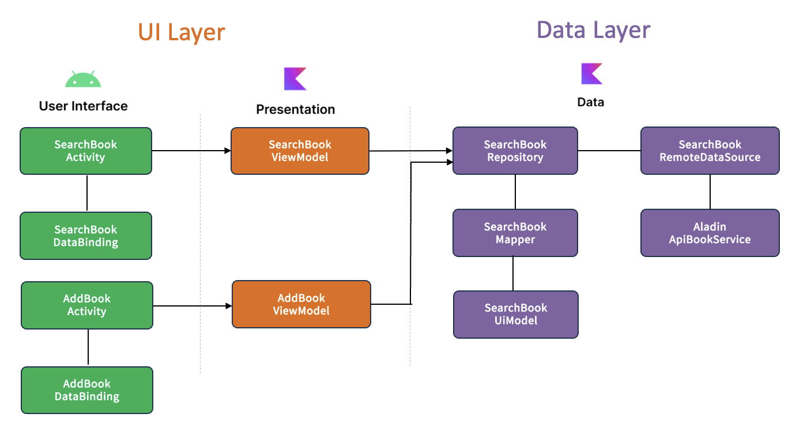
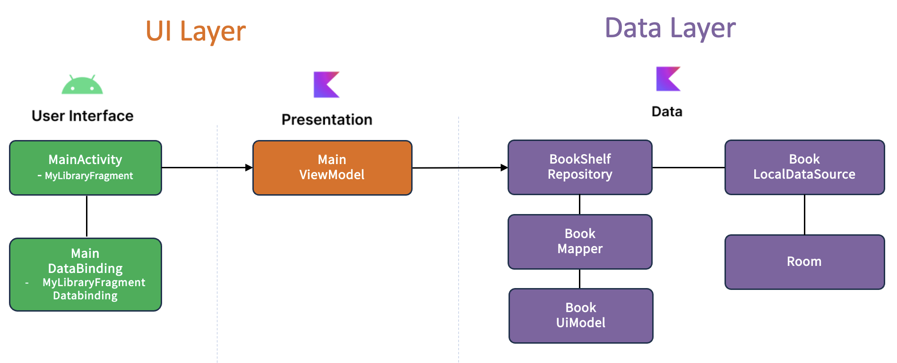
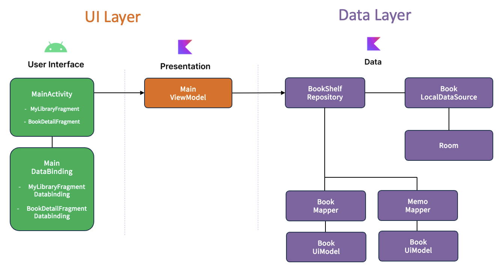
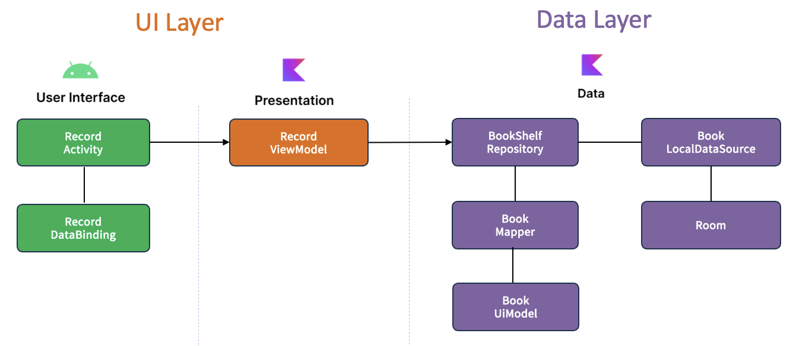
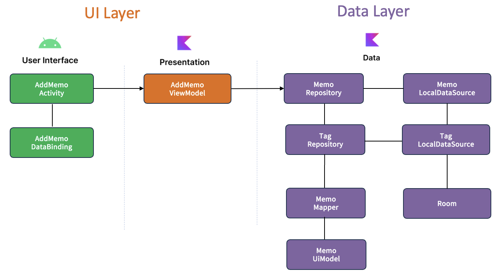

<h1 align="center">오독오독</h1>

<p align="center">
오독오독은 자신이 읽었던 책, 읽고 있는 책, 앞으로 읽을 책을 자신의 서재에 보관하고 관리하는 모바일 앱 입니다.
</p>

<p align="center">

</p>


<h3>Tech stack</h3>

- [Kotlin](https://kotlinlang.org/) 
- [Coroutines](https://github.com/Kotlin/kotlinx.coroutines)
- [Flow](https://kotlin.github.io/kotlinx.coroutines/kotlinx-coroutines-core/kotlinx.coroutines.flow/) 
- Jetpack
  - Lifecycle
  - ViewModel
  - DataBinding
  - Room
  - [Hilt](https://dagger.dev/hilt/)
- Architecture
  - MVVM Architecture (View - DataBinding - ViewModel - Model)
  - Repository Pattern

<h3>Open-source libraries</h3>

- [Material-Components](https://github.com/material-components/material-components-android): 구글의 공식 디자인 시스템을 기반으로 모던하고 일관된 UI 컴포넌트를 구현하기 위해 사용했습니다.
- [Retrofit2 & OkHttp3](https://github.com/square/retrofit): REST API 통신을 효율적으로 처리하고, 네트워크 요청의 로깅 및 커스터마이징을 위해 사용했습니다.
- [Glide](https://github.com/bumptech/glide): 이미지의 비동기 로딩, 캐싱, 리사이징 등을 최적화하여 UI 성능을 향상시키기 위해 활용했습니다.
- [Dot indicator](https://github.com/tommybuonomo/dotsindicator): ViewPager2와 함께 사용하여 페이지 위치를 직관적으로 보여주는 점 기반 인디케이터를 제공했습니다.
- [Paging 3](https://developer.android.com/topic/libraries/architecture/paging/v3-overview?hl=ko): 도서 검색 시 출력할 데이터를 효율적으로 로드하고 UI에서 매끄럽게 표시하기 위해 Paging 아키텍처를 적용했습니다.
- [Shimmer](https://github.com/facebookarchive/shimmer-android): 로딩 상태를 시각적으로 표현하기 위해 Shimmer 효과를 적용하여 사용자 경험을 개선하고, 최신 UI 트렌드를 반영한 모던한 디자인을 구현했습니다.
- [Google ML Kit](https://developers.google.com/ml-kit/vision/text-recognition/v2/android?hl=ko): 책에서 읽었던 텍스트를 보다 쉽게 추출하기 위하여 OCR 기능을 구현할 때 사용했습니다.
- [Lottie](https://github.com/airbnb/lottie-android): JSON 기반의 벡터 애니메이션을 간편하게 재생하여 인터랙티브한 UI를 구성했습니다.
- [sdp](https://github.com/intuit/sdp): 다양한 해상도에서 일관된 UI 크기를 유지하기 위해 dp 단위의 자동 스케일링을 적용했습니다.
- [ImageCropper](https://github.com/Yalantis/uCrop): 사용자가 선택한 책의 페이지 이미지에서 텍스트 부분을 자를 수 있는 이미지 편집 기능을 제공했습니다.

<h3>Open API</h3>

**오독오독** 은 도서 정보 검색 기능을 위해 [알라딘 OpenAPI](https://blog.aladin.co.kr/openapi)를 사용하고 있습니다.

## Download
**오독오독** 은 [Releases](https://github.com/stevey-sy/bookchibakchi/releases/tag/1.0.0) 에서 다운로드 가능합니다.

## Architecture
**오독오독** 은 [Google의 공식 아키텍처 가이드](https://developer.android.com/topic/architecture) 를 기반으로 한 MVVM 아키텍처와 Repository 패턴을 사용하여 설계되었습니다.


**오독오독** 의 전체 아키텍처는 UI 레이어와 데이터 레이어의 두 계층으로 구성되어 있으며, 각 계층은 고유한 컴포넌트와 역할을 가지고 있습니다.

## 📘 데이터 관계 모델
 - 애플리케이션의 핵심 데이터 모델은 다음과 같은 관계형 구조로 설계되었습니다

 - Book ↔ Memo : 1:N (일대다 관계)
   하나의 책(Book)은 여러 개의 메모(Memo)를 가질 수 있도록 설계되어, 사용자별 독서 기록을 구조적으로 관리할 수 있습니다.

 - Memo ↔ Tag : N:M (다대다 관계)
   하나의 메모는 여러 태그(Tag)를 가질 수 있고, 하나의 태그는 여러 메모에 중복될 수 있도록 설계되어, 태그 기반 분류 및 필터링 기능을 유연하게 지원합니다.
   이 관계는 Room에서 중간 조인 테이블(MemoTagCrossRef)을 통해 구현되었습니다.

## 주요 기능
<h3>도서 검색 기능</h3>
<table>
  <tr>
   <td valign="top" width="600">
       - 검색어를 입력하여 책을 검색할 수 있음<br>
       - 도서 정보 출력을 위해  알라딘 OPEN API 를 사용<br>
       - 대량의 도서 데이터를 효율적으로 불러오기 위해 Paging 라이브러리를 도입<br>
       - 사용자의 스크롤에 따라 데이터를 점진적으로 로드<br>
       - ListAdapter를 적용, DiffUtil을 활용한 데이터 변경 감지로 불필요한 View 바인딩을 줄임<br>
       - 검색된 책의 상세 정보를 확인하고 저장 가능.<br>
       <br><br><br>
      
    </td>
    <td>
      
    </td>
  </tr>
</table>

<h3>서재 관리</h3>
<table>
  <tr>
   <td valign="top" width="600">
      - 나의 서재에 저장된 책을 조회, 수정, 삭제 가능.<br>
      - RecyclerView를 책장처럼 보이도록 UI 구현<br>
      - 다 읽은 책 구분 가능하도록 Filtering 기능 제공<br>
      - ListAdapter 를 적용하여, Filter 애니메이션을 보다 부드럽게 표현<br>
      <br><br><br>
      
    </td>
    <td>
      
    </td>
  </tr>
</table>

<h3>서재 상세 화면</h3>
<table>
  <tr>
   <td valign="top" width="600">
      - 책 리스트에서 선택한 책의 상세 정보를 조회 가능<br>
      - RecyclerView -> ViewPager2 로 화면 이동 간 transition 효과를 추가하여,<br>
        책장에서 선택하는 느낌이 들도록 구현<br>
      - 선택한 책의 현재 독서 진행도, 메모 리스트 조회 가능<br>
      <br><br><br>
      
    </td>
    <td>
      
    </td>
  </tr>
</table>

<h3>독서 진행도 기록</h3>
<table>
  <tr>
   <td valign="top" width="600">
      - 독서 진행도를 타이머로 측정, 기록하는 기능<br>
      - 마지막으로 읽은 페이지를 입력하여 현재 진행도를 백분율로 측정<br>
      - 책을 완독 시 벡터 기반의 애니메이션(Lottie)을 추가, 앱의 생동감, 시각적 완성도를 향상<br>
      <br><br><br>
      
    </td>
    <td>
      
    </td>
  </tr>
</table>

<h3>메모 기록</h3>
<table>
  <tr>
   <td valign="top" width="600">
      - 독서 중 기억에 남는 문구를 메모하는 기능<br>
      - 메모 공간을 카드처럼 구현하여 배경을 선택, tag 추가 기능<br>
      - 책 내용을 보다 쉽게 가져오기 위해, OCR 기능 추가<br>
      - 음성 인식으로 텍스트 입력 가능<br>
      - 메모 컨텐츠의 길이에 맞춰 펼치기, 접기 가능<br>
      <br><br><br>
      
    </td>
    <td>
      
      
    </td>
  </tr>
</table>

## License
```xml
Designed and developed by 2022 stevey-sy (Seyoung Shin)

Licensed under the Apache License, Version 2.0 (the "License");
you may not use this file except in compliance with the License.
You may obtain a copy of the License at

   http://www.apache.org/licenses/LICENSE-2.0

Unless required by applicable law or agreed to in writing, software
distributed under the License is distributed on an "AS IS" BASIS,
WITHOUT WARRANTIES OR CONDITIONS OF ANY KIND, either express or implied.
See the License for the specific language governing permissions and
limitations under the License.
```
